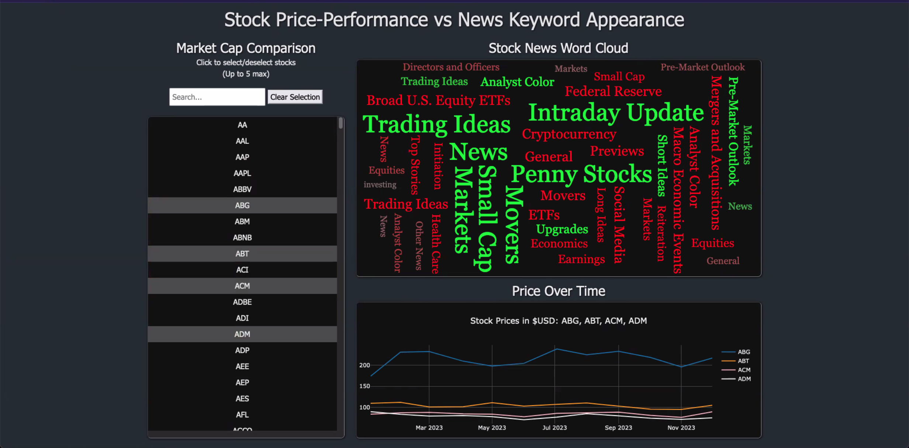

# P03-Stock-Visualizer

## Topic
This project is researching stock price fluctuations based on indicators in various key words in news and letters to shareholders. Comparisons may be made based on market cap and industry to narrow the sample size or focus on companies that share similar profiles.

Rationale is to investigate possible useful logic in predicting stock price performance.

## **File Location**
- `api-data/` you can find a few all of the code used in calling the polygon stocks and news API and how we pulled data from them to save to csv's
- `static/` you can find the java script file app.js where most of the work on this assignment was done
- `Recourses/` you can find all the ERD diagrams generated by Jody in the folder called 'ERD' as well as a bunch of other files we generated from the data pulled from Polygon and shareholder letters
- `Letters to shareholders/` you can find the shareholder letters pulled by Jonathan as well as the code Jonathan used to analyze the words
- In the main you can find a link to our basic PowerPoint as well as an initial project proposal and finally a sqlite file called `stock.visualizer.data` as well as the index.html for the dashboard 

## Data Collection
- API calls from Polygon.io
  - Daily Open/Close
  - Ticker News
- Independent research
  - Fortune 500 list from 50pros.com
  - Letters to Shareholders for Fortune 100 collected manually from Investor Relations pages

## Ethical Considerations
Anytime you begin to try to use data around the information of companies to try and predict what stock prices do, you have to take into account that stock prices are incredibly unpredictable and even the most complex models fail to take into account "human" problems. Attempting to predict what stock prices will do is akin to attempting to predict what will happen on a roulette wheel based on probabilities, it is important to convey that disclaimer when providing analysis on stock data, especially when our analysis is based on a fairly small sample size and we aren't licensed financial professionals. It is also worth considering that taking language and verbiage completely out of context also has its own ethical considerations.

## Citations
- [Stocks Daily Open/Close](https://polygon.io/docs/stocks/get_v1_open-close__stocksticker___date)
- [Stocks Ticker News](https://polygon.io/docs/stocks/get_v2_reference_news)
- [Fortune 500 Full List (2024)](50pros.com)
- [Letters to Shareholders](https://docs.google.com/spreadsheets/d/1Ys4PHpQTHDB8jlXUA0ntZ3Trb_8naOEOPVwB2qJkkV4/edit#gid=645464558)

# Instructions
## Data Visualization Track Requirements (75 points)
### Data and Delivery (20 points)
* The dataset contains at least 100 unique records. (5 points)

* A database is used to house the data (SQL, MongoDB, SQLite, etc.). (5 points)

* The GitHub repo has a README.md that includes the following: (10 points)

  * An overview of the project and its purpose

  * Instructions on how to use and interact with the project

  * At least one paragraph summarizing efforts for ethical considerations made in the project

  * References for the data source(s)

  * References for any code used that is not your own

### Visualizations (25 points)
* A minimum of three unique views present the data. (10 points)
* The visualizations are presented in a clear, digestible manner. (5 points)
* The data story is easy to interpret for users of all levels. (10 points)
### Usability (30 points)
* The script, notebook, or webpage created to showcase data visualizations runs without error. (10 points)

* A Python or JavaScript library not shown in class is used in the project. (10 points)

* The project includes some level of user-driven interaction, conforming to one of the following designs: (10 points)

  * HTML menus, dropdowns, and/or textboxes to display JavaScript-powered visualizations

  * Flask backend with interactive API routes that serve back Python or JavaScript created plots

  * Visualizations created from user-selected filtered data

## Data Engineering Track Requirements (75 points)
### Database Design (40 points)
* The project uses ETL workflows to ingest data into the database. (10 points)

* The original dataset(s) are transformed prior to storing it in the database. (5 points)

* A database is used to house the data (SQL, MongoDB, SQLite, etc.). (5 points)

* The database has at least two tables (SQL) or collections (NoSQL). (5 points)

* The project documents the choice of the database used and why. (5 points)

* The project includes documentation of the ETL workflow with diagrams or ERD. (10 points)

### Data and Delivery (35 points)
* The database contains at least 100 unique records. (5 points)

* The project uses one additional library not covered in class related to data engineering. (10 points)

* The project includes a method for reading data from the database and displaying it for future use, such as: (10 points)

  * Pandas DataFrame

  * Flask API with JSON output

* The GitHub repo has a README.md that includes the following: (10 points)

  * An overview of the project and its purpose

  * Instructions on how to use and interact with the project

  * At least one paragraph summarizing efforts for ethical considerations made in the project

  * References for the data source(s)

  * References for any code used that is not your own

## Both Track Requirements
### Group Presentation (25 points)
* All group members speak during the presentation. (5 points)
* The content is relevant to the project. (5 points)
* The presentation maintains audience interest. (5 points)
* Content, transitions, and conclusions flow smoothly within any time restrictions. (10 points)
